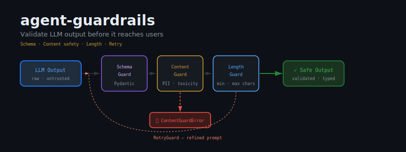
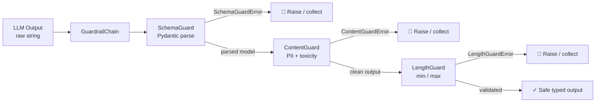
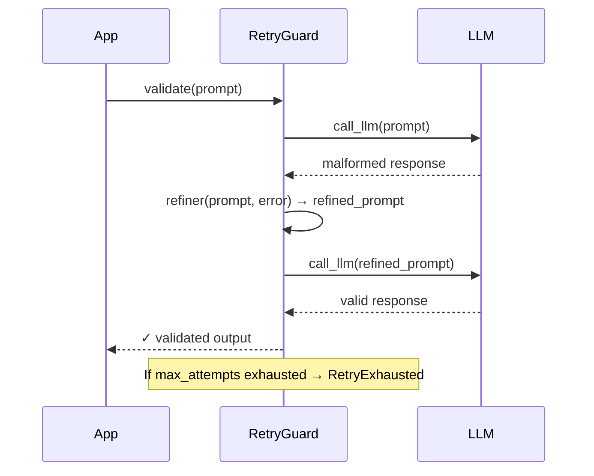

<div align="center">



# agent-guardrails

**LLMs hallucinate JSON, leak PII, and ignore your format instructions. agent-guardrails enforces the contract.**

[](https://pypi.org/project/agent-guardrails/)
[](https://pypi.org/project/agent-guardrails/)
[](LICENSE)
[](tests/)

*Composable output validation for production LLM agents.*<br>
*Schema enforcement · PII detection · Length limits · Automatic retry.*

</div>

---

## The Problem

Every LLM output is untrusted input. Here is what happens when you treat it otherwise:

- **Malformed JSON crashes your application.** The model "almost" follows your format. `json.loads()` throws. Your 500ms pipeline dies. Users see a 500.
- **SSNs and email addresses surface in responses.** You ask for a summary. The model copies verbatim from context — including the user record it was given. GDPR violation. Support ticket. Legal call.
- **A single "think step by step" triggers a 10,000-token monologue.** You pay for it. Your downstream prompt window overflows. The next tool call gets truncated context.
- **One bad LLM call kills the entire run.** No retry. No fallback. The agent crashes at step 3 of 8, leaving partial state in your database and no error the user can act on.

`agent-guardrails` is a single-import fix for all four.

---

## Installation

```bash
pip install agent-guardrails
```

---

## Guards

### `SchemaGuard` — Enforce output structure with Pydantic

```python
from pydantic import BaseModel
from agent_guardrails import SchemaGuard, SchemaGuardError

class AnalysisResult(BaseModel):
    summary: str
    confidence: float
    sources: list[str]

guard = SchemaGuard(AnalysisResult)

# Valid JSON → returns parsed Pydantic model
result = guard.validate('{"summary": "...", "confidence": 0.9, "sources": ["arxiv.org"]}')
print(result.confidence)   # 0.9  — typed, not a dict

# Invalid → raises SchemaGuardError
guard.validate('{"summary": "missing fields"}')
# SchemaGuardError: validation failed — missing fields: confidence, sources
```

**Raises:** `SchemaGuardError` — message includes the exact Pydantic validation error.

---

### `ContentGuard` — Block PII and unsafe content

```python
from agent_guardrails import ContentGuard, ContentGuardError

guard = ContentGuard(
    check_pii=True,          # SSN, credit cards, email, phone numbers
    check_toxic=True,        # Hate speech, explicit content
    check_injection=True,    # Prompt injection attempts
)

# Safe content passes through
safe = guard.validate("The quarterly revenue was $4.2M, up 18% YoY.")

# PII triggers ContentGuardError
guard.validate("Contact John at john@example.com or call 555-867-5309.")
# ContentGuardError: PII detected — email_address at position 16

# Check without raising
is_safe = guard.is_safe("some text")   # bool

# Soft mode — returns violations list instead of raising
soft_guard = ContentGuard(check_pii=True, raise_on_violation=False)
violations = soft_guard.validate("SSN: 123-45-6789")
# [ContentViolation(type=<ViolationType.PII>, label='ssn', snippet='123-45-6…', start=5, end=16)]
```

**Raises:** `ContentGuardError` — includes violation type, label, and truncated snippet (never leaks full sensitive data).

---

### `LengthGuard` — Enforce response size

```python
from agent_guardrails import LengthGuard, LengthGuardError

# Characters
guard = LengthGuard(min_chars=10, max_chars=2000)
guard.validate("ok")          # LengthGuardError: too short (2 chars, min 10)
guard.validate("a" * 5000)   # LengthGuardError: too long (5000 chars, max 2000)

# Tokens (approximate: 1 token ≈ 4 chars)
guard = LengthGuard(max_tokens=512)

# Words
guard = LengthGuard(min_words=5, max_words=200)
```

**Raises:** `LengthGuardError` — reports actual vs. limit.

---

### `RetryGuard` — Automatic retry with prompt refinement

```python
from agent_guardrails import RetryGuard, RetryExhausted

def call_llm(prompt: str) -> str:
    # Your LLM call here
    return openai_client.chat(prompt)

# Default: 3 attempts, catches any Exception
guard = RetryGuard(llm_fn=call_llm, max_attempts=3)
result = guard.validate(initial_prompt)

# Custom refiner — build a better prompt on each failure
def refiner(prompt: str, error: Exception) -> str:
    return (
        f"{prompt}\n\n"
        f"Your previous response failed validation: {error}\n"
        "Please respond with valid JSON only. No markdown, no explanation."
    )

guard = RetryGuard(llm_fn=call_llm, max_attempts=3, refiner=refiner)

try:
    result = guard.validate(prompt)
except RetryExhausted as e:
    print(f"Failed after {e.attempts} attempts. Last error: {e.last_error}")
```

**Raises:** `RetryExhausted` — after `max_attempts` failures. Contains `attempts` count and `last_error`.

---

## `GuardrailChain` — Compose guards into a pipeline

Guards compose. The output of each guard becomes the input to the next.

```python
from pydantic import BaseModel
from agent_guardrails import GuardrailChain, SchemaGuard, ContentGuard, LengthGuard

class Answer(BaseModel):
    answer: str
    confidence: float

chain = GuardrailChain([
    SchemaGuard(Answer),              # 1. Parse JSON → Answer model
    ContentGuard(check_pii=True),     # 2. Scan for PII in validated text
    LengthGuard(max_chars=500),       # 3. Enforce length on the answer field
], name="answer-pipeline")

# All pass → returns parsed Answer model
result = chain.validate('{"answer": "The GDP grew 3.2%", "confidence": 0.87}')
print(result.answer)       # "The GDP grew 3.2%"
print(result.confidence)   # 0.87

# Any guard fails → GuardrailChainError
# GuardrailChainError: [answer-pipeline] Guard #1 (ContentGuard) failed: PII detected...
#   chain.guard_index   → 1
#   chain.guard_name    → "ContentGuard"
#   chain.cause         → ContentGuardError(...)

# Continue-on-failure mode
chain = GuardrailChain([...], stop_on_first=False)
# Collects all failures, raises GuardrailChainError with full summary
```

**Chain as callable:**

```python
chain = GuardrailChain([SchemaGuard(Answer), ContentGuard()])
validated = chain('{"answer": "42", "confidence": 1.0}')   # __call__ → validate
```

---

## Validation Pipeline



---

## RetryGuard Flow



---

## Integration: verdict + sentinel

`agent-guardrails` sits at the **output layer** of your agent stack:

| Package | Role |
|---|---|
| **agent-guardrails** | Validate output — schema, content, length, retry |
| **verdict** | Evaluate agent quality — task completion, reasoning, tool use |
| **sentinel** | Guard execution — max steps, cost ceiling, loop detection |

```python
# Full stack: guard output → evaluate quality
from agent_guardrails import GuardrailChain, SchemaGuard, ContentGuard
from agent_evals import AgentEvaluator, AgentResult, EvalCase

class AgentOutput(BaseModel):
    answer: str
    confidence: float

output_chain = GuardrailChain([
    SchemaGuard(AgentOutput),
    ContentGuard(check_pii=True),
])

def safe_agent(prompt: str) -> AgentResult:
    raw = call_your_llm(prompt)
    validated = output_chain.validate(raw)          # Enforce contract
    return AgentResult(output=validated.answer, ...)

evaluator = AgentEvaluator(agent_fn=safe_agent)
report = evaluator.evaluate(test_cases)
```

---

## Philosophy

> **A blacksmith's tools need no filter — his craft is precise. Your LLM is not a blacksmith.**

A master craftsman produces exactly what is needed: no more, no less. The output is correct by construction because the skill is internalised.

LLMs are not craftsmen. They are stochastic approximators optimised for human preference, not contract compliance. The JSON schema you defined, the length you specified, the PII you forbade — these constraints mean nothing to the sampler.

`agent-guardrails` is the contract enforcer you cannot get from the model itself. Not because the model is bad — because correctness requires determinism, and determinism requires code.

---

## Contributing

See [CONTRIBUTING.md](CONTRIBUTING.md). Run the test suite:

```bash
pip install -e ".[dev]"
pytest tests/ -v
```

---

<div align="center">
<sub>Built by <a href="https://github.com/darshjme">Darshankumar Joshi</a> · MIT License</sub>
</div>
